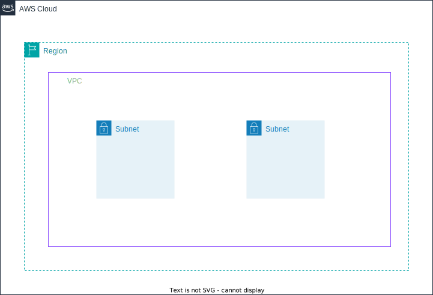

# 作成するもの
## リージョン
東京リージョン（ap-northeast-1）

## VPC
10.1.0.0/16

## Subnet
サブネットを２つ作成する
- public-subnet-1a
- private-subnet-1a

1つは public-sunet-1a としているが、
この時点ではインターネットゲートウェイへのルートがないので、
実態としては public にはなっていない。

## 構成図

