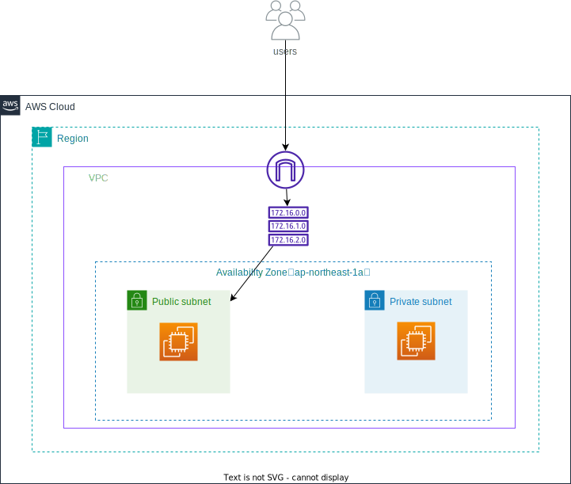

# 作成するもの
## リージョン
東京リージョン（ap-northeast-1）

## VPC
10.1.0.0/16

## Subnet
サブネットを２つ作成する
- public-subnet-1a
- private-subnet-1a

1つは public-sunet-1a としているが、
この時点ではインターネットゲートウェイへのルートがないので、
実態としては public にはなっていない。

## Internet-gateway
インタネットゲートウェイを追加する

## Route Tabel
以下の3つで構成される
- aws_route_table
  ルートテーブルを作成する
- aws_route
  ルートテーブルにルートを作成する
- aws_route_table_association
  ルートテーブルとサブネットの間、
  もしくは、ルートテーブルとインターネットゲートウェイ or バーチャルプライベートゲートウェイ の関連付けを作成する

## EC2
パブリックサブネット、プライベートサブネット内にEC2インスタンスを構築。
key pair は構築前に作成しておく。
Terraform の aws_instance ブロック内の
key_name に事前に作成した、key pair の名前を記載。

## 構成図

